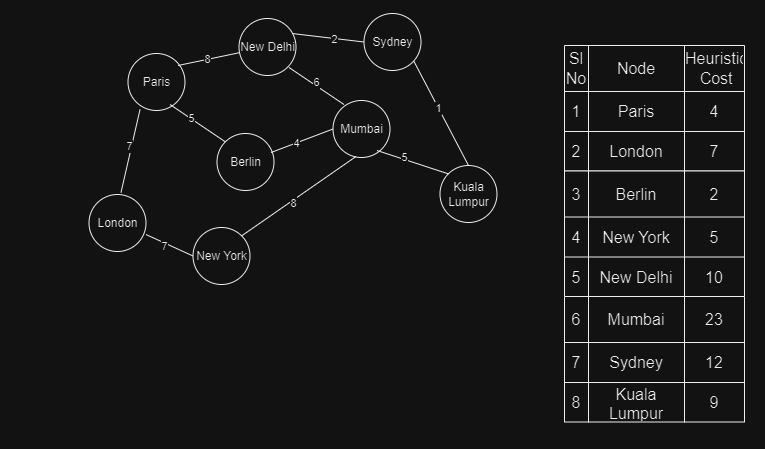

Spotify can extend its functionality to recommending the most suitable events and concerts to the user. Offering  event recommendations can differentiate Spotify from competitors, attracting more users and enhancimg its market strategies.
# Algorithm
## Searching Technique used: A* algorithm <a href="#a*">[1]</a>

1. The A* search algorithm will consider concerts as nodes in a graph, where edges represent relationships based on artist popularity, venue capacity, and ticket availability.
2. Nodes (concerts) are evaluated using a heuristic function that can be based on how often the user listens to the artist, location of the concert from user, genre of the concert, and the previous listening activity of the user.
3. f=heuristic value+combined cost
4. A* algorithm is adapted to all potential events (nodes) from the user, to find the best events in order. The event with the lowest 'f' will be the best event.
# Time Complexity
1. The time complexity of A* algorithm is O(b^d), where 'b' is the average number of edges to a node, and 'd' is the number of nodes in the resulting path.
2.  The better the heuristic function is, the better is the time complexity.
# Space Complexity
The space complexity of A* algorithm is O(n), where 'n' is the number of nodes in the graph.
# References
1. Hart, Peter E., Nils J. Nilsson, and Bertram Raphael. "A formal basis for the heuristic determination of minimum cost paths." IEEE transactions on Systems Science and Cybernetics 4.2 (1968): 100-107.
