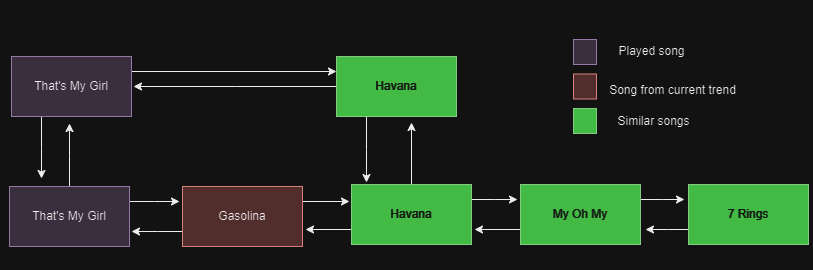

Spotify creates mixes based on the frequently preferred songs of the user, artist, mood and genre. These songs start with the songs users like and get update with songs Spotify thinks will be loved by the user[^1].
# Market Benefits
1. Spotify uses clustering technology to identify distinct subgroupings within users’ listening patterns, and then build recommendations around those, mixing in appropriate new suggestions along with the known favorites.
2. This can be used to quickly modify playlists based on user interactions and generate multiple positive recommendations.
3. Can increase daily and monthly listeners of an artist and increase streams.
4. Viral songs from social media can help increase user engagement.
# Algorithm
## Data Structure identified: Skip List[^2]
1. The songs that the user clicks to play, and the songs similar to the played song [(click here to know more)](recommend_song.md) are pushed into a skip list.
2. Skip list is efficient in this task, as the playlist is frequently and dynamically updated.
3. The code for skip list can be found [here](../codes/skiplist.cpp).
  

## Time Complexity
1. Time complexity for insertion, deletion and searching is O(log n), where 'n' is the number of songs in the playlist.
## Space Complexity
1. Space complexity for skip list is O(n), where 'n' is the number of number of songs in the playlist.
[^1]: [How Your Daily Mix “Just Gets You”](https://20230524t095215-dot-pr-newsroom-wp.uc.r.appspot.com/2018-05-18/how-your-daily-mix-just-gets-you/)
[^2]: Pugh, William. "Skip lists: a probabilistic alternative to balanced trees." Communications of the ACM 33.6 (1990): 668-676.
