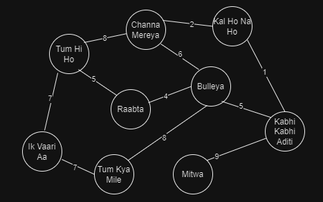

Spotify recommends the next song based on the metadata of the songs. This metadata includes details like release date, title, artist name, featured artists, songwriter credits, producers, credits, label,  genre, language
# Market Benefits
1. Helpping the user generate multiple positive recommendations, and help them save their time by not skipping songs.
2. Newer artists can be discovered, which will help the application receive sustainable user grwoth.
3. The amount of time the user spends on the app can drastically increase with good recommendations.

# Algorithm
## Algorithm suggested: Best First Search ( Informed Search)
1. The songs can be represented as a graph, with the songs as nodes. The number of metrics that match between two songs can be the weight of the edge connecting them.  
2. Best-First Search can be implemented to find the best list of songs, based on their weight. The nodes will be sorted in descending order for best-first search.  

 
3. The code for best first search can be found [here](../codes/best_first.java). 

# Time Complexity:
The time complexity for best-first search is O(n*log n), where 'n' is the number of nodes in the graph, i.e., number of songs.

# Space Complexity:
The space complexity for best-first search is O(n), where 'n' is the number of nodes in the graph, i.e., number of songs.

