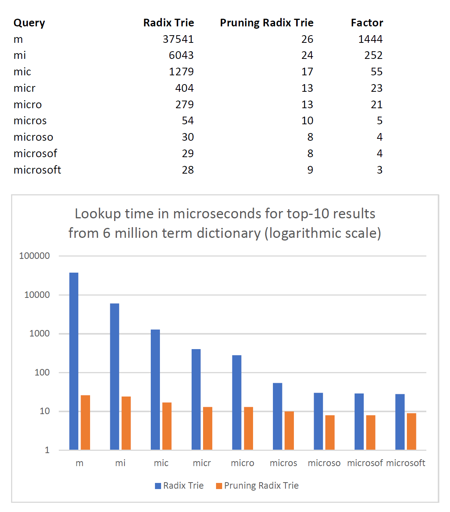

The major business case of a music player application is to search for a song or playlist, and play the selected item.  
In Spotify, search results are grouped by categories which are songs, artists, albums and playlists. Instead of simply listing all results containing the search keyword, Spotify only displays the top five search results above all categories.
 
Furthermore, Spotify assists users in searching songs of other languages (non-English) by allowing users to enter Romanized characters in replace of foreign languages. For example, if a user wants to listen to a Hindi song, he can type the romanized hindi of the title. 
(Type 'Channa Mereya' instead of 'चन्ना मेरेया')
# Market Benefits
Efficient searching of cached songs based on recently played, liked and listening history of the user.
 If the song titile is unknown, searching from a minimum of 3 words from the lyrics will show the song based on lyrics match.
 Auto-complete can be used to predict which song the user aims to search for, based on the few letters entered.

# Challenges
Spotify has a database of 82 million songs, due to the rise in songs being released on a daily basis. The users must be able to search their song in seconds.
 
 
# Data Structure and Implementation
## Data Structure used: Pruning Radix Trie
1. A song can be searched with minimum number of letters, with the auto-complete feature enabling a better suggestion. 
2. Pruning Radix Tries can be used for efficient searching in Spotify, initially using the cached data of users. 
3. Pruning radix trees work 1000 times faster than a radix trie/patricia trie. We are interested  only in the top-k most relevant songs.
4. Pruning radix tree can achieve massive reduction of lookup time for top-k results, by pruning the non-promising branches.
5. The code for Pruning Radix Trie can be found [here](../codes/prunigRadixTrie.java).
## Time Complexity
For searching, Radix trie <a href="#radix">[1]</a> has a time complexity of O(k), where 'k' denotes number of letters entered for searching. Pruning Radix tree reduces this time by upto a factor of 1000. <a href="#radix2">[2]</a>  

[(Image source)](https://seekstorm.com/blog/pruning-radix-trie/)
 
## Space Complexity
The space complexity of Radix Trie is O(n*p), where 'n' denotes the number of nodes, and 'p' denotes the pointers in each node.
 

# References
1. Leis, Viktor, Alfons Kemper, and Thomas Neumann. "The adaptive radix tree: ARTful indexing for main-memory databases." 2013 IEEE 29th International Conference on Data Engineering (ICDE). IEEE, 2013.
2. [Pruning Radix Trie](https://seekstorm.com/blog/pruning-radix-trie/)
