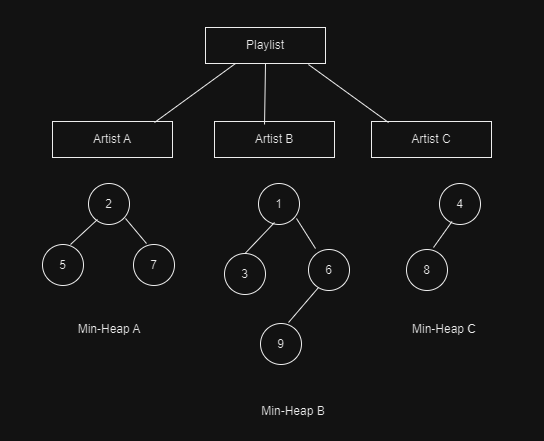

Spotify Shuffle is a unique listening experience which completely shuffles a playlist and plays it in a completely different order.
 
When we select shuffle, Spotify takes the songs in our current playlist and creates a different, temporary playlist. The major difference is that oue songs are now in a “random” order.
# Market Benefits
1. The user is in control of what they listen to, as the shuffle is done to the selected playlist.
2. Shuffling of playlists is primarily based on the unbiased permutation approach of Fisher Yates.

# Challenges 
1. Shuffling of playlists based on Fisher Yates shuffle played a few songs from the same artist right after each other.    
2. Sometimes, the random shuffling will create a possibility of hearing the same type of music ( music from same artist, same album, same genre, etc) <a href="#S1">[1]</a>
    
After several user feedbacks, the currently adapted algorithm takes songs from the selected playlist, categorizes them by artist, and ensures that songs from the same artist are spread out. This ensures we won’t hear another from the same artist until about 20 to 30 percent through the shuffled playlist. <a href="#S2">[2]</a>

# Algorithm
### Data Structure: Min-Heap
1. The songs in the playlist can be stored as a heap. Songs of each artist can be stored in one min-heap, with the value being the priority of a song.
2. Spotify can shuffle songs by accessing the root of each artist's heap, and accessing the song with the highest priority.
3. After a song is played, it is removed from the heap, and heapify is performed to maintain the min heap property.
4. The code for min-heap can be found [here](../codes/min_heap.cpp).
### Design Diagram

### Time Complexity
1. The time taken to insert songs into a min-heap for shuffling is O(log n), where 'n' is number of songs of a particular artist.  
2. The time taken to access highest priority song id O(1).  
3. The time taken to delete a song after it is played is O(log n), where 'n' is number of songs of a particular artist.  
Total time complexity = O(log n) + O(1) + O(log n) ≈ O(log n)

### Space Complexity
The space complexity will be O(n1 + n2 + ... + nm), where m is the number of artists, and ni is the song for 'i'-th artist.

 

# References
1.  [How to Shuffle Songs?: Spotify R&D](https://engineering.atspotify.com/2014/02/how-to-shuffle-songs/)
2.  [The Art of Shuffling Music](https://keyj.emphy.de/balanced-shuffle/)

